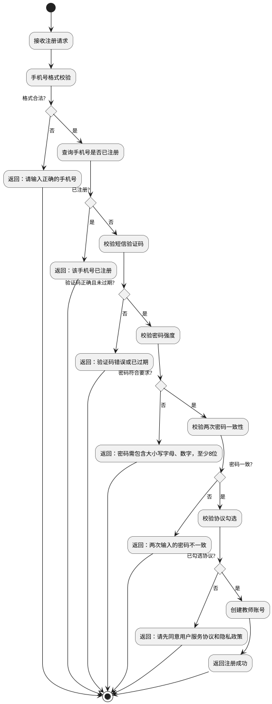
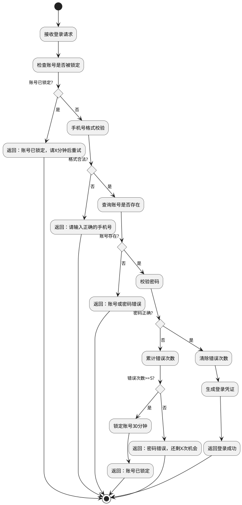
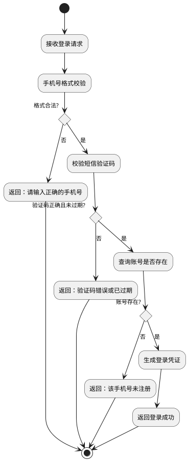
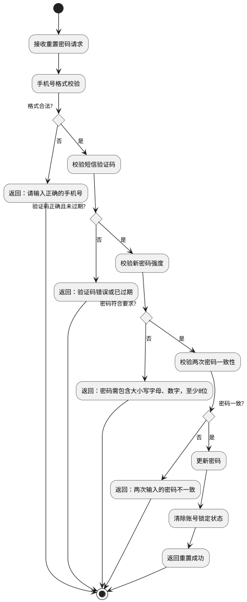

# 教师登录注册 产品需求文档

## 0. 文档修订记录

| 版本号 | 修改日期   | 修改人 | 修改内容     | 备注 |
| :----- | :--------- | :----- | :----------- | :--- |
| V1.0   | 2024-12-19 | -      | 初始版本创建 | -    |

---

## 1. 项目背景与目标

### 1.1 背景

> 在线教育平台需要为教师提供安全、便捷的账号体系，支持教师通过手机号完成注册、登录及密码找回等操作。当前需要建立完整的教师身份认证流程，并具备基本的账号安全防护能力。

### 1.2 目标

* 提供手机号注册功能，建立教师账号体系
* 支持密码登录和短信验证码登录两种方式，提升登录便捷性
* 实现忘记密码自助找回流程，降低运营成本
* 建立账号安全机制，防止暴力破解

### 1.3 范围

* **包含：**
  * 教师注册功能
  * 教师登录功能（密码登录、验证码登录）
  * 忘记密码/重置密码功能
  * 账号安全锁定机制
* **不包含：**
  * 第三方登录（微信、QQ等）
  * 学员端登录注册
  * 管理员端登录注册

---

## 2. 全局规约

### 2.1 权限说明

| 角色 | 权限范围 |
| :--- | :------- |
| 游客 | 访问登录页、注册页、忘记密码页 |
| 教师 | 登录后访问教师工作台 |

### 2.2 术语定义

| 术语 | 定义 |
| :--- | :--- |
| 验证码 | 6位数字短信验证码，有效期5分钟 |
| 账号锁定 | 连续输错密码达到阈值后，账号在一定时间内禁止登录 |

---

## 3. 业务模型图

### 3.1 注册流程

### 3.2 密码登录流程

### 3.3 验证码登录流程

### 3.4 忘记密码流程

---

## 4. 功能需求详细说明

### 4.1 注册功能

> **定位**：教师通过手机号完成账号注册。

#### 4.1.1 注册表单

* **入口**：登录页点击"立即注册"链接

**表单字段**

| 字段名称 | 类型 | 必填 | 限制/规则 |
| :------- | :--- | :--- | :-------- |
| 手机号 | 输入框 | 是 | 11位手机号，格式：1[3-9]开头 |
| 验证码 | 输入框 | 是 | 6位数字 |
| 昵称 | 输入框 | 是 | 2-20个字符，允许重复 |
| 密码 | 密码框 | 是 | 8位以上，需包含大小写字母和数字 |
| 确认密码 | 密码框 | 是 | 需与密码一致 |
| 服务协议 | 复选框 | 是 | 需勾选同意《用户服务协议》和《隐私政策》 |

**密码强度指示器**

| 强度等级 | 判定条件 | 显示颜色 |
| :------- | :------- | :------- |
| 非常弱 | 满足1项要求 | 红色 |
| 弱 | 满足2项要求 | 橙色 |
| 一般 | 满足3项要求 | 黄色 |
| 强 | 满足4项要求（含特殊字符） | 蓝色 |
| 非常强 | 满足5项要求 | 绿色 |

> 密码要求项：长度≥8位、包含小写字母、包含大写字母、包含数字、包含特殊字符（可选加分项）

**操作反馈**

| 操作 | 场景 | 提示语 | 形式 |
| :--- | :--- | :----- | :--- |
| 获取验证码 | 手机号为空或格式错误 | 请输入正确的手机号 | Toast |
| 获取验证码 | 成功 | 验证码已发送 | Toast |
| 提交注册 | 手机号已注册 | 该手机号已注册 | Toast |
| 提交注册 | 验证码错误 | 请输入6位验证码 | Toast |
| 提交注册 | 昵称过短 | 昵称至少2个字符 | Toast |
| 提交注册 | 密码强度不足 | 密码需包含大小写字母、数字，至少8位 | Toast |
| 提交注册 | 两次密码不一致 | 两次输入的密码不一致 | Toast |
| 提交注册 | 未勾选协议 | 请先同意用户服务协议和隐私政策 | Toast |
| 提交注册 | 成功 | 显示注册成功弹窗，引导登录 | 弹窗 |

---

### 4.2 登录功能

> **定位**：教师通过密码或短信验证码登录系统。

#### 4.2.1 密码登录

* **入口**：登录页默认Tab

**表单字段**

| 字段名称 | 类型 | 必填 | 限制/规则 |
| :------- | :--- | :--- | :-------- |
| 手机号 | 输入框 | 是 | 11位手机号 |
| 密码 | 密码框 | 是 | 支持显示/隐藏切换 |
| 记住我 | 复选框 | 否 | 勾选后记住登录状态 |

**操作反馈**

| 操作 | 场景 | 提示语 | 形式 |
| :--- | :--- | :----- | :--- |
| 提交登录 | 手机号格式错误 | 请输入正确的手机号 | Toast |
| 提交登录 | 密码为空 | 请输入密码 | Toast |
| 提交登录 | 密码错误（未锁定） | 密码错误，还剩X次机会 | Toast |
| 提交登录 | 账号已锁定 | 显示锁定弹窗 | 弹窗 |
| 提交登录 | 成功 | 登录成功 | Toast |

#### 4.2.2 验证码登录

* **入口**：登录页切换至"验证码登录"Tab

**表单字段**

| 字段名称 | 类型 | 必填 | 限制/规则 |
| :------- | :--- | :--- | :-------- |
| 手机号 | 输入框 | 是 | 11位手机号 |
| 验证码 | 输入框 | 是 | 6位数字 |

**操作反馈**

| 操作 | 场景 | 提示语 | 形式 |
| :--- | :--- | :----- | :--- |
| 获取验证码 | 手机号格式错误 | 请输入正确的手机号 | Toast |
| 获取验证码 | 成功 | 验证码已发送 | Toast |
| 提交登录 | 验证码错误 | 请输入6位验证码 | Toast |
| 提交登录 | 手机号未注册 | 该手机号未注册 | Toast |
| 提交登录 | 成功 | 登录成功 | Toast |

---

### 4.3 忘记密码功能

> **定位**：教师通过手机验证码自助重置密码。

* **入口**：登录页点击"忘记密码？"链接

**步骤流程**

| 步骤 | 名称 | 说明 |
| :--- | :--- | :--- |
| 1 | 验证手机号 | 输入手机号和验证码进行身份验证 |
| 2 | 设置新密码 | 输入新密码和确认密码 |
| 3 | 完成 | 显示重置成功，引导返回登录 |

**步骤1：验证手机号**

| 字段名称 | 类型 | 必填 | 限制/规则 |
| :------- | :--- | :--- | :-------- |
| 手机号 | 输入框 | 是 | 11位手机号 |
| 验证码 | 输入框 | 是 | 6位数字 |

**步骤2：设置新密码**

| 字段名称 | 类型 | 必填 | 限制/规则 |
| :------- | :--- | :--- | :-------- |
| 新密码 | 密码框 | 是 | 8位以上，需包含大小写字母和数字 |
| 确认密码 | 密码框 | 是 | 需与新密码一致 |

**操作反馈**

| 操作 | 场景 | 提示语 | 形式 |
| :--- | :--- | :----- | :--- |
| 步骤1-下一步 | 手机号格式错误 | 请输入正确的手机号 | Toast |
| 步骤1-下一步 | 验证码错误 | 请输入6位验证码 | Toast |
| 步骤2-确认重置 | 密码强度不足 | 密码需包含大小写字母、数字，至少8位 | Toast |
| 步骤2-确认重置 | 两次密码不一致 | 两次输入的密码不一致 | Toast |
| 步骤2-确认重置 | 成功 | 进入步骤3完成页 | 页面跳转 |

---

### 4.4 账号安全机制

> **定位**：防止暴力破解，保护账号安全。

#### 4.4.1 密码错误锁定

| 配置项 | 值 | 说明 |
| :----- | :- | :--- |
| 最大错误次数 | 5次 | 连续输错密码的次数阈值 |
| 锁定时长 | 30分钟 | 触发锁定后的禁止登录时长 |
| 错误次数重置 | 登录成功时 | 成功登录后清零错误计数 |
| 锁定解除 | 自动解除/重置密码 | 锁定时间到期自动解除，或通过忘记密码重置 |

**锁定弹窗内容**

| 元素 | 内容 |
| :--- | :--- |
| 图标 | 锁定图标（红色） |
| 标题 | 账号已锁定 |
| 说明 | 由于多次输入错误密码，您的账号已被临时锁定 |
| 倒计时 | 请在 X 分钟后重试 |
| 按钮 | 我知道了 |

#### 4.4.2 验证码安全

| 配置项 | 值 | 说明 |
| :----- | :- | :--- |
| 验证码长度 | 6位数字 | - |
| 有效期 | 5分钟 | 超时需重新获取 |
| 发送间隔 | 60秒 | 防止频繁发送 |

---

## 5. 非功能需求

### 5.1 性能要求

| 场景 | 指标 |
| :--- | :--- |
| 登录接口响应 | ≤500ms |
| 注册接口响应 | ≤500ms |
| 短信验证码发送 | ≤3s |

### 5.2 数据埋点

| 事件名称 | 触发时机 | 参数 |
| :------- | :------- | :--- |
| register_page_view | 进入注册页 | - |
| register_submit | 点击注册按钮 | success: boolean |
| login_page_view | 进入登录页 | - |
| login_submit | 点击登录按钮 | type: password/sms, success: boolean |
| forgot_password_submit | 完成密码重置 | success: boolean |
| account_locked | 账号被锁定 | phone: 脱敏手机号 |

### 5.3 兼容性要求

| 类型 | 要求 |
| :--- | :--- |
| 浏览器 | Chrome 80+、Firefox 75+、Safari 13+、Edge 80+ |
| 移动端 | iOS Safari 13+、Android Chrome 80+ |
| 分辨率 | 最小支持 375px 宽度（移动端适配） |

### 5.4 安全要求

| 要求项 | 说明 |
| :----- | :--- |
| 密码存储 | 使用 bcrypt 等安全算法加密存储，禁止明文 |
| 传输加密 | 全站 HTTPS |
| 验证码防刷 | 同一手机号60秒内只能发送一次 |
| 接口防护 | 登录/注册接口增加图形验证码或滑块验证（可选，后续迭代） |
