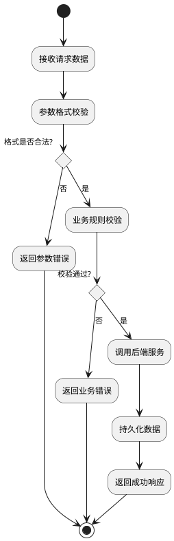
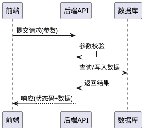

# [功能名称] 产品需求文档

## 0. 文档修订记录

| 版本号 | 修改日期   | 修改人 | 修改内容     | 备注 |
| :----- | :--------- | :----- | :----------- | :--- |
| V1.0   | YYYY-MM-DD | -      | 初始版本创建 | -    |

---

## 1. 项目背景与目标

### 1.1 背景

> 描述当前存在的问题或业务痛点，说明为什么需要这个功能。

### 1.2 目标

> 列出本功能要达成的核心目标，建议用列表形式。

* 目标1
* 目标2
* 目标3

### 1.3 范围

* **包含：**
  * 功能范围1
  * 功能范围2
* **不包含：**
  * 排除项1
  * 排除项2

---

## 2. 全局规约

### 2.1 权限说明

| 角色  | 权限范围 |
| :---- | :------- |
| 角色A | 权限描述 |
| 角色B | 权限描述 |

### 2.2 术语定义（可选）

| 术语  | 定义     |
| :---- | :------- |
| 术语1 | 定义说明 |

---

## 3. 业务模型图（按需）

> 根据实际业务复杂度选择是否需要图示，简单功能可省略此章节。
>
> **核心原则**：图示应聚焦于**系统行为**，描述程序需要做什么（校验逻辑、业务流程、前后端交互），而非用户操作步骤。
>
> 仅在以下场景按需添加：
> - **业务流程图**：描述系统内部处理逻辑，包含数据校验、业务规则判断、异常处理分支等
> - **时序图**：描述前后端交互、多系统/服务间的调用顺序和数据流转
> - **状态流转图**：当核心业务对象存在多状态切换时，描述状态变更的触发条件和系统处理
> - **数据关系图**：当涉及多实体关联时，描述数据结构和关联关系
>
> 建议使用 PlantUML 绘制，保持文档可维护性。
>
> **注意**：请使用 PlantUML **旧版活动图语法**（使用 `(*)` 和 `-->` 箭头连接），避免使用新语法（如 `start`、`stop`、`:动作;`、`repeat` 等），以确保兼容性。

<!-- 示例：业务流程图（聚焦系统行为，使用旧版语法） -->
<!--

-->

<!-- 示例：前后端交互时序图 -->
<!--

-->

---

## 4. 功能需求详细说明

### 4.1 [端/模块名称]

> **定位**：简要说明该端/模块的核心职责。

#### 4.1.1 [功能点名称]

> 功能简述。

* **入口**：描述用户如何进入该功能。

**表单字段（如适用）**

| 字段名称 | 类型 | 必填 | 限制/规则 |
| :------- | :--- | :--- | :-------- |
| 字段1 | 输入框 | 是 | 最多 X 字 |
| 字段2 | 下拉选择 | 否 | 选项说明 |

**列表字段（如适用）**

| 字段名称 | 说明 |
| :------- | :--- |
| 字段1 | 字段说明 |
| 字段2 | 字段说明 |

* **排序规则**：描述默认排序方式。
* **分页**：每页显示 X 条记录。

**操作规则（如适用）**

| 状态/条件 | 可用操作 |
| :-------- | :------- |
| 条件1 | 操作A、操作B |
| 条件2 | 操作C |

**操作反馈**

| 操作 | 场景 | 提示语 | 形式 |
| :--- | :--- | :----- | :--- |
| 操作名 | 成功/失败场景 | 提示文案 | Toast/弹窗 |

**极端情况处理（如适用）**

| 操作 | 场景 | 处理方式 | 提示语 |
| :--- | :--- | :------- | :----- |
| 操作名 | 异常场景 | 处理逻辑 | 提示文案 |

---

## 5. 非功能需求

### 5.1 性能要求

> 描述响应时间、并发量等性能指标，如暂无可标注"后续按需补充"。

### 5.2 数据埋点

> 描述需要埋点的用户行为或事件，如暂无可标注"后续按需补充"。

### 5.3 兼容性要求（可选）

> 描述浏览器、设备、系统版本等兼容性要求。

### 5.4 安全要求（可选）

> 描述数据安全、权限控制等安全相关要求。
```
